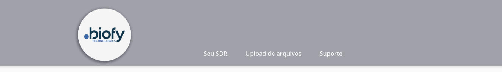
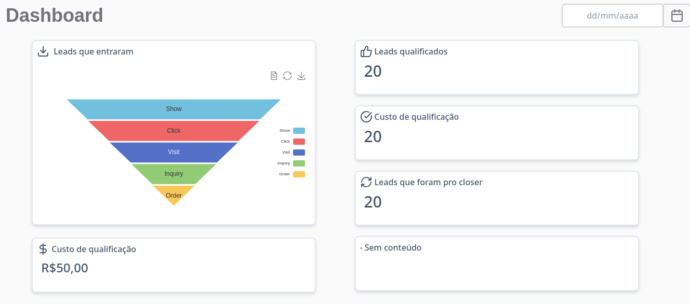
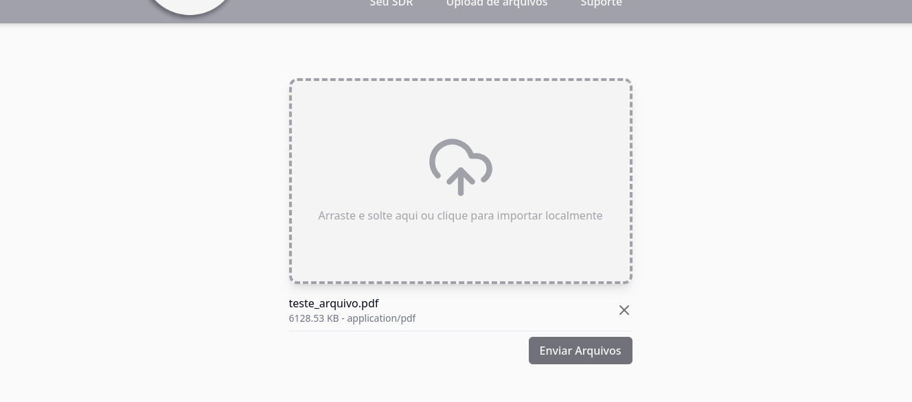
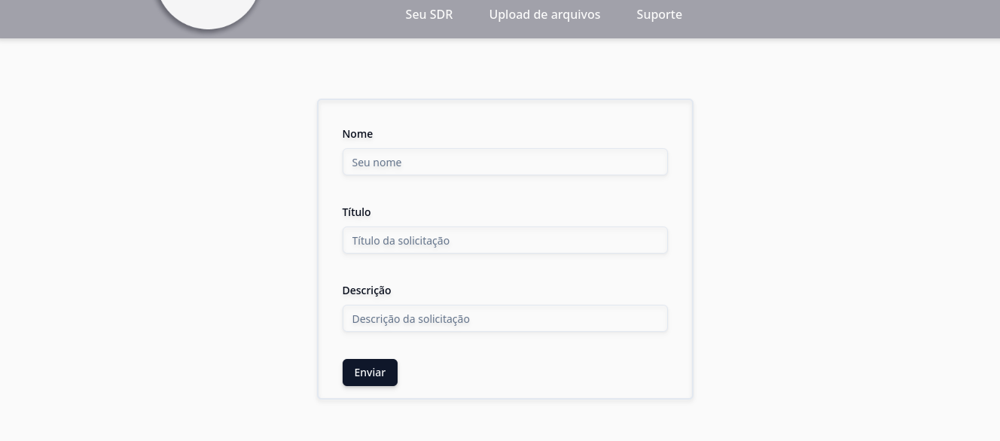

# Projeto SDR

A interface do projeto é composta por um menu com as opções: dashboard, upload de arquivos e suporte.

## Dashboard:
  Irá exibir os dados dos leads que entrarem pelo whatsapp e exibir de acordo com a data selecionada, a quantidade baseada nos status. Ex: Leads que entraram, Leads qualificados, Custo de qualificação, Leads que foram pro closer e Custo de qualificação.

  

## Upload de arquivos:
  Irá disponibilzar uma área onde o usuário poderá arrastar ou anexar um arquivo(PDF ou txt).

## Suporte:
  Irá exibir um formulário para criação de um ticket de  suporte com Nome, Título e Descrição do problema.

# Tecnologias utilizadas

  A interface é construida com o framework [React](https://react.dev/) utilizando a ferramenta [Vite](https://vite.dev/) para criação do projeto inicial, [TypeScript](https://www.typescriptlang.org/)  para tipagem dos dados, [TailwindCSS](https://tailwindcss.com/) para estilização dos componentes, [Lucide](https://lucide.dev/guide/packages/lucide-react) para ícones, a biblioteca [Echarts](https://echarts.apache.org/examples/en/editor.html?c=funnel) para o grafico de funil, [React-datepicker](https://reactdatepicker.com/) junto com [date-fns](https://date-fns.org/) para criar o o componente CustomDatePicker.tsx, [Shadcn-ui](https://ui.shadcn.com/docs) para criar o formulário de suporte e por fim [React-Hook-Fom](https://ui.shadcn.com/docs/components/form) junto com [Zod](https://zod.dev/) para validação de dados do formulário.

